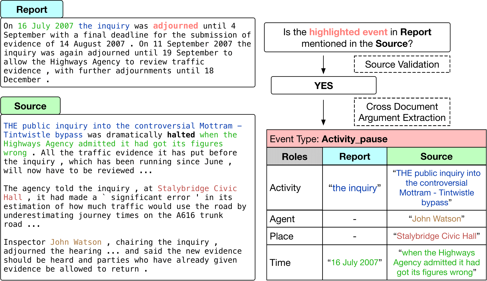

# [Frames Across Multiple Sources](https://arxiv.org/abs/2311.05601) (FAMuS)

This repository contains the data for the sub-tasks of FAMuS along with the data preprocessing scripts that can be used to run various models.

FAMuS introduces two sub-tasks aimed at Cross-Document Event Extraction as shown in the figure below:



The tasks are:

1.  **Source Validation (SV)**:
    Given a report text $R$, a target event trigger (mention) $e$ occurring in $R$, and a candidate source text $S$, determine whether $S$ contains a description of the same event as the one denoted by $e$.

    `data/source_validation/` contains the `train`/`dev`/`test` splits for this task and a description of all the fields in the data

2.  **Cross Document Argument Extraction (CDAE)**:
    Given a report text $R$, a target event trigger $e$ in $R$, and a correct source text $S$, extract all arguments of $e$ in both $R$ and $S$. We assume $e$ is assigned an event type from some underlying ontology of event types $E_1, . . . E_N$ , where each $E_i$ has roles $R_1^{(i)}, . . . , R_M^{(i)}$, and where e’s arguments must each be assigned one of these roles.

    `data/cross_doc_role_extraction` contains the `train`/`dev`/`test` splits for this task description of all the fields in the data

For more details on the tasks, data collection, and models, please read our [paper](https://arxiv.org/abs/2311.05601).

## Python Environment Setup

We recommend using a fresh Python environment for training/evaluating our model scripts on the dataset. We tested our codebase on Python 3.11

You can create a new conda environment by running the following command:

```
conda create -n famus python=3.11
conda activate famus
```

Before installing requirements, we recommend you install Pytorch on your system based on your GPU/CPU configurations following the instructions [here](https://pytorch.org/get-started/locally/).
Then inside the root directory of this repo, run:

```
pip install -r requirements.txt
```

## Models

### Evaluation

To reproduce the evaluation metrics in the paper, follow the below instructions:

1. Source Validation:
   To download the best longformer model from the paper, run the following command from the root of the repo:

   ```
   bash models/source_validation/download_longformer_model.sh
   ```

   To run evaluation of the model on dev or test, run the following:

   ```
    bash src/job_runs/run_source_val_evaluation.sh
   ```

   You can find the metrics output in `src/metrics/`

2. Cross Document Argument Extraction:

   To be completed.
