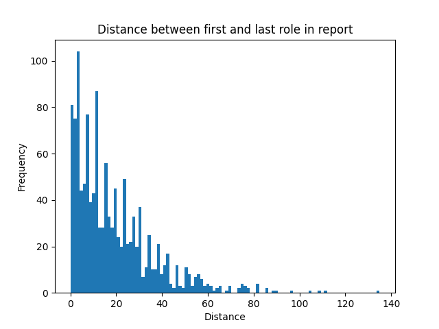

# Dataset Statistics 
This folder contains the code to generate statistics for the dataset. 

## Basic Statistics
The basic statistics for the dataset are generated using the `basic_statistics.py` script. The script collects the statistics:
1. Average number of tokens in the report and source text.
2. The average number of filled roles across all frames. 
3. The average number of filled roles for each individual frame.

### Whole Dataset: 
#### Token Counts 
Average Report Tokens: `58.95529411764706` \
Min Report Tokens: `10` \
Max Report Tokens: `526` \
Average Source Token: `1163.9843137254902` \
Min Source Tokens: `154` \
Max Source Tokens: `5553` \

#### Role Counts
For json outputs of the specific frame/role data see `sorted_norm_roles.json`
Average Roles Across Frames: `3.015686274509804`

Top 10 Frames with most roles (normalized by number of roles in a frame):
1. `Subsisting`-> `1.0`
2. `Transportation_status`-> `1.0`
3. `Chaos`-> `0.95`
4. `Vehicle_landing`-> `0.95`
5. `Visiting`-> `0.95`
6. `Coming_to_be`-> `0.9333333333333332`
7. `Cause_to_make_progress`-> `0.9`
8. `Detonate_explosive`-> `0.9`
9. `Dodging`-> `0.9`
10. `Event`-> `0.8666666666666667`

Top 10 Frames with least roles (normalized by number of roles in a frame):
1. `Killing`-> `0.39999999999999997`
2. `Change_position_on_a_scale`-> `0.38`
3. `Cause_to_be_sharp`-> `0.36`
4. `Motion`-> `0.35555555555555557`
5. `Cure`-> `0.35`
6. `Change_of_leadership`-> `0.3333333333333333`
7. `Proliferating_in_number`-> `0.275`
8. `Cause_motion`-> `0.2727272727272727`
9. `Apply_heat`-> `0.2285714285714286`
10. `Education_teaching`-> `0.21538461538461537`

### Train Dataset: 
Total Documents: 765 
#### Token Counts
Average Report Tokens: `59.209150326797385` \
Min Report Tokens: `10` \
Max Report Tokens: `526` \
Average Source Token: `1087.7660130718955` \
Min Source Tokens: `154` \
Max Source Tokens: `5553` \

#### Role Counts
For json outputs of the specific frame/role data see `sorted_norm_roles_train.json`
Average Roles Across Frames: `2.943790849673201`

Top 10 Frames with most roles (normalized by number of roles in a frame):
1. `Coming_to_be`-> `1.0`
2. `Subsisting`-> `1.0`
3. `Transportation_status`-> `1.0`
4. `Visiting`-> `1.0`
5. `Chaos`-> `0.9166666666666666`
6. `Detonate_explosive`-> `0.9166666666666666`
7. `Vehicle_landing`-> `0.9166666666666666`
8. `Activity_stop`-> `0.8888888888888888`
9. `Attention`-> `0.8888888888888888`
10. `Being_in_operation`-> `0.8888888888888888`

Top 10 Frames with least roles (normalized by number of roles in a frame):
1. `Damaging`-> `0.33333333333333337`
2. `Cure`-> `0.3333333333333333`
3. `Proliferating_in_number`-> `0.3333333333333333`
4. `Rotting`-> `0.3333333333333333`
5. `Theft`-> `0.3333333333333333`
6. `Change_of_leadership`-> `0.2962962962962963`
7. `Motion`-> `0.2962962962962963`
8. `Cause_motion`-> `0.2727272727272727`
9. `Apply_heat`-> `0.2380952380952381`
10. `Education_teaching`-> `0.20512820512820512`

### Dev Dataset:
Total Documents: 255

#### Token Counts
Average Report Tokens: `60.062745098039215` \
Min Report Tokens: `11` \
Max Report Tokens: `208` \
Average Source Token: `1511.1490196078432` \
Min Source Tokens: `177` \
Max Source Tokens: `5389` \

#### Role Counts
For json outputs of the specific frame/role data see `sorted_norm_roles_dev.json`
Average Roles Across Frames: `3.392156862745098`

Top 10 Frames with most roles (normalized by number of roles in a frame):
1. `Activity_resume`-> `1.0`
2. `Activity_start`-> `1.0`
3. `Attack`-> `1.0`
4. `Being_located`-> `1.0`
5. `Breaking_out_captive`-> `1.0`
6. `Cause_change_of_strength`-> `1.0`
7. `Cause_to_continue`-> `1.0`
8. `Cause_to_fragment`-> `1.0`
9. `Cause_to_make_progress`-> `1.0`
10. `Change_event_duration`-> `1.0`

Top 10 Frames with least roles (normalized by number of roles in a frame):
1. `Create_physical_artwork`-> `0.25`
2. `Hit_target`-> `0.25`
3. `Translating`-> `0.25`
4. `Cause_to_be_dry`-> `0.2`
5. `Forging`-> `0.2`
6. `Cause_motion`-> `0.18181818181818182`
7. `Inhibit_movement`-> `0.16666666666666666`
8. `Proliferating_in_number`-> `0.125`
9. `Exercising`-> `0.0`
10. `Killing`-> `0.0`

### Test Dataset:
Total Documents: 255

#### Token Counts
Average Report Tokens: `57.08627450980392` \
Min Report Tokens: `17` \
Max Report Tokens: `181` \
Average Source Token: `1045.4745098039216` \
Min Source Tokens: `173` \
Max Source Tokens: `4856` \

#### Role Counts
For json outputs of the specific frame/role data see `sorted_norm_roles_test.json`
Average Roles Across Frames: `2.854901960784314`

Top 10 Frames with most roles (normalized by number of roles in a frame):
1. `Attending`-> `1.0`
2. `Becoming`-> `1.0`
3. `Cause_change_of_strength`-> `1.0`
4. `Cause_to_make_progress`-> `1.0`
5. `Chaos`-> `1.0`
6. `Cooking_creation`-> `1.0`
7. `Dodging`-> `1.0`
8. `Escaping`-> `1.0`
9. `Event`-> `1.0`
10. `Ingestion`-> `1.0`

Top 10 Frames with least roles (normalized by number of roles in a frame):
1. `Hit_target`-> `0.25`
2. `Proliferating_in_number`-> `0.25`
3. `Motion`-> `0.2222222222222222`
4. `Agriculture`-> `0.2`
5. `Grinding`-> `0.2`
6. `Manipulation`-> `0.2`
7. `Render_nonfunctional`-> `0.2`
8. `Arrest`-> `0.16666666666666666`
9. `Education_teaching`-> `0.15384615384615385`
10. `Apply_heat`-> `0.14285714285714285`

## Distance Statistics
### Report 

Mean: `18.857704402515722` \
Median: `14.0` \
Max: `135` \
Min: `0` \
Standard deviation: `17.569476741474855` \
Variance: `308.68651296922593` 

### Source

Mean: `203.41981132075472` \
Median: `64.5` \
Max: `3311` \
Min: `0` \
Standard deviation: `386.984062919` \
Variance: `149756.66495342352` 